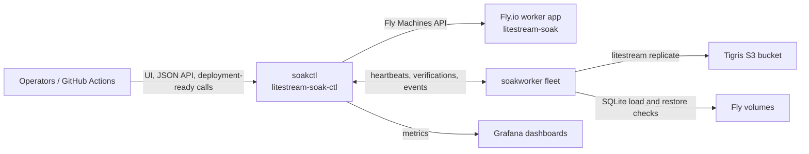

# Litestream Soak

## Purpose

`litestream-soak` is a continuous soak-testing harness for
[Litestream](https://github.com/benbjohnson/litestream). It runs Litestream
against realistic SQLite workloads on Fly.io so replication regressions can be
caught before a Litestream release.

Workers build and run Litestream plus `litestream-test` from a pinned upstream
Litestream SHA. Deployments roll the worker fleet to new soak and Litestream
commits, then the control plane tracks whether the updated fleet verifies
cleanly.

## Architecture

The system is split into a control plane and worker fleet:

- `cmd/soakctl`: control plane for Fly app `litestream-soak-ctl`. It manages
  the desired fleet, rolling deployments, worker heartbeat and verification
  ingest, dormancy and expiry lifecycle, alert delivery with fingerprint
  deduplication and webhooks, Fly platform-log monitoring, volume inventory and
  unattached-volume cleanup, and the web UI plus JSON API.
- `cmd/soakworker`: worker process for Fly app `litestream-soak`. It populates
  or reuses the SQLite database on its Fly volume, writes Litestream config,
  supervises the Litestream process, runs synthetic and replay load, polls
  runtime stats, runs verification cycles, and reports heartbeats,
  verifications, and worker events to the control plane.
- Tigris-compatible S3 storage holds Litestream replica data. The bucket and
  endpoint are configured through the control plane and worker environment.



The control plane serves `/ui`, JSON endpoints under `/api`, `/metrics`, and an
unauthenticated `/healthz`. UI and read APIs are protected with basic auth when
configured. Admin endpoints under `/api/admin/*` use an admin bearer token, with
basic-auth fallback controlled by config. Worker report endpoints use the
separate `SOAK_WORKER_TOKEN` bearer token.

## Worker Profiles

`internal/orchestrator/fleet.go` defines the main fleet in `DefaultMainFleet()`.
Each source, including PR sources, uses this same profile set unless the source
is unsupported.

| Profile | Worker | What It Exercises |
| --- | --- | --- |
| `low-volume` | `worker-main-low-vol` | Constant synthetic writes at low rate with a small initial database. |
| `high-volume` | `worker-main-high-vol` | Higher-rate wave synthetic writes, larger payloads, more load workers, and a 100 GB volume. |
| `burst-volume` | `worker-main-burst-vol` | Burst-pattern synthetic writes against a 100 GB volume. |
| `read-heavy` | `worker-main-read-heavy` | Constant synthetic writes with a high read ratio to exercise read-heavy contention. |
| `gharchive-replay` | `worker-main-gharchive` | Replays GH Archive events from `https://data.gharchive.org/2025-01-01-0.json.gz`. |
| `gharchive-mixed` | `worker-main-gharchive-mixed` | Combines wave synthetic load with looping GH Archive replay. |
| `taxi-replay` | `worker-main-taxi-replay` | Replays `datasets/taxi_sample.csv`. |
| `taxi-mixed` | `worker-main-taxi-mixed` | Combines wave synthetic load with looping taxi replay. |
| `orders-replay` | `worker-main-orders-replay` | Replays `datasets/orders_sample.jsonl`. |
| `low-vol-syd` | `worker-main-low-vol-syd` | Low-volume synthetic workload in `syd` for cross-region lag signal. |
| `high-vol-ams` | `worker-main-high-vol-ams` | High-volume wave workload in `ams` for cross-region lag signal. |

Regional workers measure cross-region behavior and are excluded from release
quality scoring. The release-quality code only scores `ord` workers and
explicitly excludes `low-vol-syd` and `high-vol-ams`.

Many-database profiles are opt-in with `SOAK_ENABLE_MANY_DB_FLEET=true`.
When enabled, the main and PR fleets also reconcile `many-dbs-100-list`,
`many-dbs-100-dir`, and `many-dbs-1000-dir`. These profiles seed databases
under `/data/dbs`, drive writes into the configured active subset with an
in-process writer, report aggregate runtime/process metrics only, and verify a
sample of databases per cycle. They are excluded from release-quality scoring.

## Fleet Sources

The `main` source is the long-running baseline fleet. Failures there are
expected to be informative: they show either a current Litestream regression, a
platform problem, a workload-specific harness issue, or a known-bad state that
the control plane can archive and pause.

PR fleets use sources named `pr-NNN`. The PR workflow builds a worker image with
`LITESTREAM_SHA` set to the upstream PR head SHA, then notifies the control
plane with `source=pr-NNN`. The control plane rewrites the default fleet names
for that source, creates missing workers, and rolls existing workers to the
latest image and version metadata.

When creating non-main workers, the control plane tries to fork a running main
worker volume with the same profile and region. If no matching running main
worker volume exists, or the fork fails, it creates a fresh encrypted Fly volume
and records the reason. Successful PR runs can be archived and torn down
automatically by success teardown. PR fleets can also be stopped or destroyed by
the max-age policy when that policy is enabled.

## Verification And Release Quality

Each worker periodically runs a verification cycle:

1. remove prior restore artifacts;
2. pause synthetic and replay load;
3. checkpoint the source database;
4. wait for Litestream sync;
5. restore and validate the replica;
6. resume load and report the result.

Verification statuses are meaningful:

- `passed`: restore validation succeeded.
- `failed`: the worker completed enough of the cycle to conclude replication or
  validation failed.
- `aborted`: the cycle was interrupted, usually because the worker context was
  canceled. Aborted reports are recorded as events but do not mark the worker
  degraded.

Deployments are recorded with soak Git SHA, Litestream SHA, image ref, source,
and PR number. A deployment-ready notification creates or updates the source
fleet, performs a rolling update, and resumes dormant workers for probing.
Before each rollout step, the control plane checks whether a newer ready
deployment superseded the current one; superseded rollouts are skipped.

The release-quality views build rollout progress and scorecards from
post-deployment verification windows. They report updated workers, workers still
awaiting a fresh verification, failed workers, failure signatures, pass rate,
and source-to-source or previous-rollout comparisons.

## Operations And Usage

Production apps:

- Control plane: `litestream-soak-ctl`
- Worker fleet: `litestream-soak`
- Web UI: `https://litestream-soak-ctl.fly.dev`
- Health check: `https://litestream-soak-ctl.fly.dev/healthz`

Main deployments are handled by `.github/workflows/deploy-main.yml` on pushes
to `main` and by manual `workflow_dispatch`. The workflow ignores changes under
`docs/**`, `grafana/**`, and `tmp/**`; otherwise it detects whether control
plane code, worker code, or both changed. It runs `go test ./...`, builds both
commands, deploys the control plane when needed, builds and pushes the worker
image when needed, and calls `scripts/notify-deployment-ready.sh` so `soakctl`
rolls the fleet.

`.github/workflows/sync-upstream-main.yml` periodically checks upstream
Litestream `main`, skips work if that SHA is already deployed, and otherwise
builds a new worker image and notifies the main fleet. `.github/workflows/soak-pr.yml`
builds PR-specific worker images from an upstream Litestream PR SHA and notifies
the matching `pr-NNN` source. There are no repository `pull_request` workflows
for this repo; PR verification is local and at ship time unless a workflow is
manually dispatched.

Grafana dashboards live in `grafana/`:

- `grafana/soak-overview-dashboard.json`
- `grafana/soak-release-quality-dashboard.json`
- `grafana/soak-source-compare-dashboard.json`
- `grafana/soak-drilldown-dashboard.json`

Configuration is intentionally environment-driven. For the control plane, start
with `fly.control.toml` and the startup log fields in `cmd/soakctl/main.go`
(`soakctl starting`) to see the active config surface. For workers, use
`fly.toml`, `internal/worker/config.go`, and the per-worker environment built by
`internal/orchestrator/dormancy.go`.

For detailed operator procedures, see `docs/operator-runbook.md`.

## Development

Common local checks:

```bash
go build ./...
go test ./...
golangci-lint run --new-from-rev=origin/main
```

Use `golangci-lint` when available. The `--new-from-rev` form keeps local lint
focused on changes relative to the main branch.

Useful Make targets:

```bash
make build
make test
make run-local
make test-replay
make docker-worker
make compose-build
make refresh-worker-fleet
```

Repository layout:

- `cmd/`: executable entrypoints for `soakctl` and `soakworker`.
- `internal/orchestrator/`: control-plane API, UI, fleet management, rollouts,
  alerts, dormancy, platform-log ingest, and volume inventory.
- `internal/worker/`: worker config, Litestream supervision, load/replay
  orchestration, stats polling, verification, reporting, and debug snapshots.
- `internal/model/`: SQLite persistence for workers, verifications, events,
  deployments, alerts, and run archives.
- `internal/flyapi/`: Fly Machines and volume API client types.
- `internal/replay/`: GH Archive, taxi, and orders replay adapters and engine.
- `internal/reporting/`: shared worker/control-plane reporting payloads and
  failure classification.
- `internal/s3util/`: helper for deleting replica prefixes.
- `internal/workload/`: workload config serialization.
- `datasets/`: replay sample data included in the worker image.
- `grafana/`: importable dashboards.
- `migrations/`: control-plane SQLite schema.
- `scripts/`: deployment notification, PR soak, upstream SHA resolution, and
  fleet refresh helpers.
- `docs/`: operator runbook and integration examples.

`Dockerfile.worker` builds Litestream and `litestream-test` from
`LITESTREAM_SHA`, records the resolved SHA in `/opt/soak/litestream.sha`, builds
`soakworker`, and copies replay datasets into `/opt/soak/datasets`.
`Dockerfile.control` builds `soakctl` and includes `flyctl` for platform-log and
deployment support. Both runtime images use `docker-entrypoint.sh` to ensure
`/data` ownership and then drop privileges to the `soak` user with `setpriv`.
