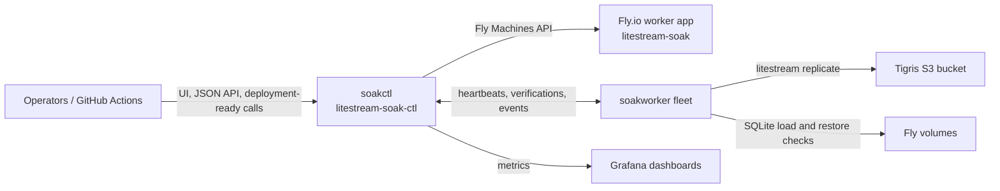

# Litestream Soak

## Purpose

`litestream-soak` is a continuous soak-testing harness for
[Litestream](https://github.com/benbjohnson/litestream). It runs Litestream
against realistic SQLite workloads on Fly.io so replication regressions can be
caught before a Litestream release.

Workers build and run Litestream plus `litestream-test` from a pinned upstream
Litestream SHA. Deployments roll the worker fleet to new soak and Litestream
commits, then the control plane tracks whether the updated fleet verifies
cleanly.

## Architecture

The system is split into a control plane and worker fleet:

- `cmd/soakctl`: control plane for Fly app `litestream-soak-ctl`. It manages
  the desired fleet, rolling deployments, worker heartbeat and verification
  ingest, dormancy and expiry lifecycle, alert delivery with fingerprint
  deduplication and webhooks, Fly platform-log monitoring, volume inventory and
  unattached-volume cleanup, and the web UI plus JSON API.
- `cmd/soakworker`: worker process for Fly app `litestream-soak`. It populates
  or reuses the SQLite database on its Fly volume, writes Litestream config,
  supervises the Litestream process, runs synthetic and replay load, polls
  runtime stats, runs verification cycles, and reports heartbeats,
  verifications, and worker events to the control plane.
- Tigris-compatible S3 storage holds Litestream replica data. The bucket and
  endpoint are configured through the control plane and worker environment.


```mermaid
flowchart LR
    UI[Operators / GitHub Actions] -->|UI, JSON API, deployment-ready calls| CTL[soakctl\nlitestream-soak-ctl]
    CTL -->|Fly Machines API| FLY[Fly.io worker app\nlitestream-soak]
    CTL <-->|heartbeats, verifications, events| W[soakworker fleet]
    W -->|litestream replicate| S3[Tigris S3 bucket]
    W -->|SQLite load and restore checks| VOL[Fly volumes]
    CTL -->|metrics| G[Grafana dashboards]
```

The control plane serves `/ui`, JSON endpoints under `/api`, `/metrics`, and an
unauthenticated `/healthz`. UI and read APIs are protected with basic auth when
configured. Admin endpoints under `/api/admin/*` use an admin bearer token, with
basic-auth fallback controlled by config. Worker report endpoints use the
separate `SOAK_WORKER_TOKEN` bearer token.

## Worker Profiles

`internal/orchestrator/fleet.go` defines the main fleet in `DefaultMainFleet()`.
Each source, including PR sources, uses this same profile set unless the source
is unsupported.

| Profile | Worker | What It Exercises |
| --- | --- | --- |
| `low-volume` | `worker-main-low-vol` | Constant synthetic writes at low rate with a small initial database. |
| `high-volume` | `worker-main-high-vol` | Higher-rate wave synthetic writes, larger payloads, more load workers, and a 100 GB volume. |
| `burst-volume` | `worker-main-burst-vol` | Burst-pattern synthetic writes against a 100 GB volume. |
| `read-heavy` | `worker-main-read-heavy` | Constant synthetic writes with a high read ratio to exercise read-heavy contention. |
| `gharchive-replay` | `worker-main-gharchive` | Replays GH Archive events from `https://data.gharchive.org/2025-01-01-0.json.gz`. |
| `gharchive-mixed` | `worker-main-gharchive-mixed` | Combines wave synthetic load with looping GH Archive replay. |
| `taxi-replay` | `worker-main-taxi-replay` | Replays `datasets/taxi_sample.csv`. |
| `taxi-mixed` | `worker-main-taxi-mixed` | Combines wave synthetic load with looping taxi replay. |
| `orders-replay` | `worker-main-orders-replay` | Replays `datasets/orders_sample.jsonl`. |
| `low-vol-syd` | `worker-main-low-vol-syd` | Low-volume synthetic workload in `syd` for cross-region lag signal. |
| `high-vol-ams` | `worker-main-high-vol-ams` | High-volume wave workload in `ams` for cross-region lag signal. |

Regional workers measure cross-region behavior and are excluded from release
quality scoring. The release-quality code only scores `ord` workers and
explicitly excludes `low-vol-syd` and `high-vol-ams`.

Many-database profiles are opt-in with `SOAK_ENABLE_MANY_DB_FLEET=true`.
When enabled, the main and PR fleets also reconcile `many-dbs-100-list` and
`many-dbs-100-dir`. Two nested flags extend the tier ladder: with
`SOAK_ENABLE_MANY_DB_500=true` the fleets add `many-dbs-500-list`,
`many-dbs-500-dir`, and `many-dbs-500-dir-lowfreq`; with
`SOAK_ENABLE_MANY_DB_1000=true` they add `many-dbs-1000-dir`. Both nested
flags are inert unless the base flag is also set. These profiles seed
databases under `/data/dbs`, drive writes into the configured active subset
with an in-process writer, rotate active membership on a deterministic
interval, report aggregate runtime/process metrics only, and verify changed
databases per cycle. They are excluded from release-quality scoring.

Many-DB baseline profiles connect Litestream directly to Tigris. The S3 proxy
is disabled for them and is supported only for deliberate fault-injection
profiles because it rewrites and re-signs traffic. `observe` mode remains
disabled and unfixed; the soaked Litestream version has no native
`ListObjectsV2` counter, so passive LIST counting would require an upstream
Litestream change. Litestream heap-in-use, stack-in-use, and allocation rate
are captured from its `/metrics` endpoint and reported alongside the existing
process stats.

`many-dbs-500-dir-lowfreq` is the reduced-frequency control pair for
`many-dbs-500-dir`: identical workload, but with longer retention and
compaction intervals so the LIST/GC/CPU cost of compaction frequency can be
measured directly.

| Interval | Default | Lowfreq |
| --- | --- | --- |
| Snapshot | 10m | 1h |
| L1 compaction | 30s (upstream) | 5m |
| L2 compaction | 5m (upstream) | 30m |
| L3 compaction | 1h (upstream) | 6h |
| L0 retention | 5m (upstream) | 1h |
| L0 retention check | 15s (upstream) | 2m |

Worker restore checks also compare an independent, consistent source snapshot
against restored schema and typed row contents. See [logical verification](docs/logical-verification.md)
for the equality contract, resource budgets, bookkeeping policy, and opt-in real
restore test.

## Fleet Sources

The `main` source is the long-running baseline fleet. Failures there are
expected to be informative: they show either a current Litestream regression, a
platform problem, a workload-specific harness issue, or a known-bad state that
the control plane can archive and pause.

Fixture-sensitive fault regressions, including constrained-disk and S3 fault
proxy scenarios, are local/on-demand checks rather than always-on fleet gates.
They require deliberately unhealthy fixtures, such as a tiny filesystem or a
starved local cache, so prior Fly A/B runs are treated as inconclusive when the
fixture did not engage the intended fault. The Litestream fixes for compaction
resume and disk-full recovery are validated through
`scripts/local-rig-one-shot.sh` instead.

The `provider-request-canceled` local rig injects the production Tigris failure
shape, HTTP 408 with API code `RequestCanceled`, into `ListObjectsV2` and
requires the restore to recover. This verifies the S3 retry policy directly;
increasing the soak worker's verification timeout does not change whether the
SDK retries that response.

The `l0-gap-heal` local rig recreates the persistent interior L0 gap from
litestream #1151 (a permanently failed L0 upload that the replica position
advanced past) by deleting an interior remote L0 file above the L1 boundary,
then requires compaction and replication to self-heal: gap detected, position
invalidated, missing file re-uploaded from local disk, compaction completes,
and a full restore returns every row. Unpatched Litestream fails forever with
`non-contiguous transaction ids`; litestream #1155 heals it.

The `snapshot-compaction-overlap` local rig measures the memory cost of the
per-database maintenance overlap from litestream #1477 (an L9 snapshot and an
L1 compaction running concurrently on one large database). It builds a
multi-GiB database (`ONE_SHOT_OVERLAP_DB_MB`, default 1024), runs the initial
L0 sync, snapshot, and L1 compaction sequentially on one copy, then reproduces
the overlap deterministically on a second copy: the snapshot's replica stream
is gated at 95% of the snapshot's encoded size (taken from the sequential
baseline's L9 file), so the ltx encoder blocks mid-stream
with its full page index resident while the L1 compaction runs, releasing when
the compaction finishes or on a timeout (which is how a Litestream that
serializes per-database maintenance shows up, recorded in
`gate_release_reason`). `runtime.MemStats` is sampled throughout and a heap
profile is sampled after sufficient growth and spacing under the run's `profiles/` directory. This is a sampled growth profile, not an exact peak profile. A separate final heap profile is written even for phases shorter than the sampling interval, including failed phases. Fixture copies are APFS clones on macOS and the
sequential replica prefix is deleted before the overlap run, so a 16 GiB
fixture needs roughly one copy's worth of local disk and object storage.
Pass requires the overlap's heap growth to stay within 1.10x the larger
sequential phase plus one multipart upload's fixed buffers, so unpatched
Litestream (roughly additive) fails, a per-database serialization fix passes
via the timeout path, and a disk-backed page index passes with lower
bytes-per-page in every phase.

The `restore-retention-race` local rig reproduces the fleet failure where a
restore fails mid-plan with `reopen ltx file at offset 0: file does not
exist`: a restore plan is computed from the replica listing, then while its
files are read one by one, L1 compaction covers the plan's L0 files and L0
retention deletes them. Litestream's own store monitors drive compaction and
retention (L1 every 2s, L0 retention 2s checked every second, overridable via
`ONE_SHOT_RACE_L0_RETENTION_MS`), a writer streams L0 files for the scenario
window (`ONE_SHOT_RACE_SECONDS`, default 90), and full restores run back to
back. It reports restores attempted/failed, race failures, max plan depth and
L0 backlog, and counts of compactions, retention runs, and maintenance-busy
refusals from the Litestream log. Outcomes distinguish `scenario_success`,
`target_signature_observed`, `unrelated_failure`, `aborted`, and `inconclusive`.
Success requires a completed, logically valid restore with observed L0 object opens
and both compaction and positive L0 deletion counts observed during that
restore. No-op retention runs and maintenance-busy refusals are diagnostic
only. Zero exposure
is inconclusive. Unrelated errors and earlier self-healing failures prevent
success; both failure counts remain visible if both classes occur.

Each planning/restore attempt retains its start time, elapsed time, error, and
maintenance observations and actual L0 opens, including interrupted attempts. All captured logs
are retained. Logical validation compares every restored ID and value against
the append-only source prefix, checks SQLite storage types and complete
transaction boundaries, and requires at least the row count known to be
replicated before the restore. This is a fixture-specific prefix check, not
the general workload oracle tracked by #204. Sampled plans and backlog maxima
are observations, not exact restore plans or continuous peak measurements.
A normal scenario deadline may interrupt the last attempt without invalidating
earlier completed evidence; external cancellation marks the run aborted unless
a failure was already observed.

Calibration remains a separate local-only activity tracked by #107. Fixture
verdict tests do not establish known-bad/base versus known-fixed/head Litestream
separation. No parameter sweep or Fly A/B is implied by a successful rig run;
the result explicitly records calibration as unexecuted. Preserve cause-specific
controls and obtain the #107 base-3/3-fail and head-3/3-pass evidence before
promoting parameters. This rig remains opt-in.

PR fleets use sources named `pr-NNN`. The PR workflow builds a worker image with
`LITESTREAM_SHA` set to the upstream PR head SHA, then notifies the control
plane with `source=pr-NNN`. The control plane rewrites the default fleet names
for that source, creates missing workers, and rolls existing workers to the
latest image and version metadata.

When creating non-main workers, the control plane tries to fork a running main
worker volume with the same profile and region. If no matching running main
worker volume exists, or the fork fails, it creates a fresh encrypted Fly volume
and records the reason. Successful PR runs can be archived and torn down
automatically by success teardown. PR fleets can also be stopped or destroyed by
the max-age policy when that policy is enabled.

## Verification And Release Quality

Each worker periodically runs a verification cycle:

1. remove prior restore artifacts;
2. pause synthetic and replay load;
3. checkpoint the source database;
4. wait for Litestream sync;
5. restore and validate the replica;
6. resume load and report the result.

Verification statuses are meaningful:

- `passed`: restore validation succeeded.
- `failed`: the worker completed enough of the cycle to conclude replication or
  validation failed.
- `aborted`: the cycle was interrupted, usually because the worker context was
  canceled. Aborted reports are recorded as events but do not mark the worker
  degraded.
- `pending`: a bounded many-database batch succeeded, but coverage remains
  outstanding. This is neither a pass nor a failure; it preserves prior failure
  state and cannot qualify a rollout or success teardown.

Many-database verification starts with every configured database pending,
including untouched databases. Batches rotate past the last attempted database,
so failure, cancellation, overflow, and repeatedly written databases cannot
starve later paths. Only successful validation acknowledges the selected change
generation; newer writes stay pending. The queue is held in memory and restarts
conservatively enqueue all configured databases again. Pending age starts when a
database first requires coverage and is preserved across retries and new writes.

Worker metrics `soak_many_db_pending_count` and
`soak_many_db_oldest_pending_age_seconds` expose outstanding coverage, including
idle and deferred paths. Each selected cycle also reports these values in its
`pending_coverage` step. A later successful batch does not erase prior failed
reports or their diagnostic evidence.

Deployments are recorded with soak Git SHA, Litestream SHA, image ref, source,
and PR number. A deployment-ready notification creates or updates the source
fleet, performs a rolling update, and resumes dormant workers for probing.
Before each rollout step, the control plane checks whether a newer ready
deployment superseded the current one; superseded rollouts are skipped.

The release-quality views require attributed verification evidence within
post-deployment windows. Each verification retains its deployment ID, run and
machine IDs, soak and Litestream SHAs, workload generator SHA, effective workload
configuration and hash, and harness validator identity. `WORKLOAD_SHA` identifies
the generator source independently of the Litestream candidate. An absent
generator source remains unknown rather than being inferred from the candidate.

Authenticated deployment-ready notifications supply the generator `workload_sha`
from the image build. The notification helper reads the Dockerfile pin by default;
a custom generator build must supply the matching seventh argument or
`WORKLOAD_SHA`. A missing trusted generator SHA disables deployment credit.

The control plane registers each expected run before machine creation and binds
its machine ID after creation. Reports must match that run and the effective
configuration derived from the worker configuration parser. Report ingestion and
run replacement are serialized per worker. Mismatched reports retain their historical evidence but cannot update the current
worker or earn deployment credit. During upgrades, legacy managed workers without
a registered run can continue telemetry only when the reported machine, harness
build, Litestream build, source, and profile match the persisted worker identity.
These reports never register a run or earn deployment credit. Current runs without a deployment remain operational without earning
release credit. Legacy verification rows remain readable with `attributed=false`;
existing workers need a newly registered run before they can provide attributed
evidence.

Historical deployment scorecards retain attributed results after worker
replacement. Live rollout and success teardown checks additionally require the
current machine and run. The views report updated workers, workers still awaiting
a fresh verification, failed workers, failure signatures, pass rate, and
source-to-source or previous-rollout comparisons. Identified incident reports,
including recovery reports, are retained individually.

## Operations And Usage

Production apps:

- Control plane: `litestream-soak-ctl`
- Worker fleet: `litestream-soak`
- Web UI: `https://litestream-soak-ctl.fly.dev`
- Health check: `https://litestream-soak-ctl.fly.dev/healthz`

Main deployments are handled by `.github/workflows/deploy-main.yml` on pushes
to `main` and by manual `workflow_dispatch`. The workflow ignores changes under
`docs/**`, `grafana/**`, and `tmp/**`; otherwise it detects whether control
plane code, worker code, or both changed. It runs `go test ./...`, builds both
commands, deploys the control plane when needed, builds and pushes the worker
image when needed, and calls `scripts/notify-deployment-ready.sh` so `soakctl`
rolls the fleet.

`.github/workflows/sync-upstream-main.yml` periodically checks upstream
Litestream `main`, skips work if that SHA is already deployed, and otherwise
builds a new worker image and notifies the main fleet. `.github/workflows/soak-pr.yml`
builds PR-specific worker images from an upstream Litestream PR SHA and notifies
the matching `pr-NNN` source. PR CI runs unit/race tests, lint, image security checks, and the bounded real-binary compatibility suite.

Grafana dashboards live in `grafana/`:

- `grafana/soak-overview-dashboard.json`
- `grafana/soak-release-quality-dashboard.json`
- `grafana/soak-source-compare-dashboard.json`
- `grafana/soak-drilldown-dashboard.json`

Configuration is intentionally environment-driven. For the control plane, start
with `fly.control.toml` and the startup log fields in `cmd/soakctl/main.go`
(`soakctl starting`) to see the active config surface. For workers, use
`fly.toml`, `internal/worker/config.go`, and the per-worker environment built by
`internal/orchestrator/dormancy.go`.

For detailed operator procedures, see `docs/operator-runbook.md`.

## Replay pacing

Each dataset pass anchors its schedule to its first event timestamp. Event
offsets from that origin are divided by the replay speed, and deadlines are
clamped to never move backward. Equal timestamps and out-of-order events add
no extra delay: timestamps `[100, 90, 100, 110]` run at offsets `[0, 0, 0, 10]`
at speed 1. A new loop pass starts a fresh schedule.

All gaps are preserved, including gaps of ten seconds or more. Insert and retry
time consume the scheduled interval instead of extending it. Pauses freeze the
schedule and preserve the remaining gap; waiting is interruptible by pause or
cancellation. Pause acknowledgment waits for an in-flight insert to finish.
`REPLAY_SPEED` must be positive and finite. Direct engine callers may use zero
for speed 1; negative and nonfinite speeds are rejected.

`soak_replay_lag_seconds` measures nonnegative lateness at the start of each
record attempt against its scheduled deadline, including skipped and failed
records. `soak_replay_operation_seconds` measures individual insert attempt
latency, excluding retry backoff, schedule waits, and pauses between attempts.
The separate error and outcome counters retain failures even after recovery.

## GH Archive replay writes

Each GH Archive pass appends events using `<pass UUID>:<archive event ID>` as
its parent ID and the same ID in child records. A fresh UUID is allocated when
the dataset is opened, including after worker restarts. Duplicate archive IDs
within a pass are skipped. Parent and child inserts share a transaction, so a
child insert failure rolls back the parent. Existing records are retained;
looping intentionally grows the database and WAL rather than becoming idle.
The original archive ID remains the suffix of the stored ID.

Replay metrics count input records, not SQL statements or child rows:

- `soak_replay_attempts_total`: records reaching insertion, excluding retries.
- `soak_replay_rows_total`: records with committed mutations, excluding duplicates.
- `soak_replay_skipped_rows_total`: duplicates skipped without mutations.
- `soak_replay_dropped_rows_total`: records whose insertion ultimately failed.
- `soak_replay_errors_total`: individual insert errors, including failures followed
  by a successful retry; duplicates are not errors.

At completion, attempted records equal mutated plus skipped plus failed records.
An in-flight or canceled attempt may not yet have a terminal outcome. Invalid
GH Archive payloads still retain the parent and increment
`soak_replay_gharchive_dropped_payloads_total`; they do not create a typed child.
Pass logs report attempted, mutated, skipped, and failed record counts.

## Development

Maintained builds use Go 1.25.13. Make targets and the one-shot rig select this
compiler explicitly, including builds in the upstream Litestream module.
Docker builders pin the Go 1.25.13 Bookworm image by digest and disable automatic
toolchain switching. The control image and deployment jobs build flyctl v0.4.101 from pinned
source with an explicit x/crypto v0.56.0 patch, labeled `0.4.101-soak.1`.
Its dedicated builder uses Go 1.26.6 because flyctl requires Go 1.26. Binary compiler
metadata is printed during image builds and retained under `/opt/soak/*.buildinfo`.
The upstream Litestream SHA resolution and build flags remain unchanged.
See [binary security evidence](docs/binary-security.md) for scan states,
operational remediation, residual triage, and comparison instructions.

The one-shot rig includes the compiler in its cache and result names and writes
a `.buildinfo` companion to each result. Keep that companion with benchmark
results; compare baseline and candidate using the same compiler and record both
source SHAs. Old caches and results remain separate. `make build-deps` builds the
existing local upstream checkout and prints its SHA; it does not select a new ref.

Common local checks:

```bash
export GOTOOLCHAIN=go1.25.13
go version
go build ./...
go test ./...
golangci-lint run
govulncheck -show verbose ./...
```

Use `golangci-lint` when available. Review non-reachable module findings from
`govulncheck` separately from reachable vulnerabilities; do not suppress them.

Useful Make targets:

```bash
make build
make test
make run-local
make test-replay
make docker-worker
make compose-build
make refresh-worker-fleet
```

Repository layout:

- `cmd/`: executable entrypoints for `soakctl` and `soakworker`.
- `internal/orchestrator/`: control-plane API, UI, fleet management, rollouts,
  alerts, dormancy, platform-log ingest, and volume inventory.
- `internal/worker/`: worker config, Litestream supervision, load/replay
  orchestration, stats polling, verification, reporting, and debug snapshots.
- `internal/model/`: SQLite persistence for workers, verifications, events,
  deployments, alerts, and run archives.
- `internal/flyapi/`: Fly Machines and volume API client types.
- `internal/replay/`: GH Archive, taxi, and orders replay adapters and engine.
- `internal/reporting/`: shared worker/control-plane reporting payloads and
  failure classification.
- `internal/s3util/`: helper for deleting replica prefixes.
- `internal/workload/`: workload config serialization.
- `datasets/`: replay sample data included in the worker image.
- `grafana/`: importable dashboards.
- `migrations/`: control-plane SQLite schema.
- `scripts/`: deployment notification, PR soak, upstream SHA resolution, fleet
  refresh helpers, and `pull-profiles.sh` (download a worker's Litestream
  pprof captures via flyctl for `go tool pprof`).
- `docs/`: operator runbook and integration examples.

`Dockerfile.worker` builds Litestream and `litestream-test` from
`LITESTREAM_SHA`, records the resolved SHA in `/opt/soak/litestream.sha`, builds
`soakworker`, and copies replay datasets into `/opt/soak/datasets`.
`Dockerfile.control` builds `soakctl` and includes `flyctl` for platform-log and
deployment support. Both runtime images use `docker-entrypoint.sh` to ensure
`/data` ownership and then drop privileges to the `soak` user with `setpriv`.

## Deployment recovery and evidence

All main component deployments, including upstream worker sync requests, run
through the `deploy-main` concurrency group. Running deployments are not
cancelled by new requests, so a remote Fly deployment can finish before another
starts. GitHub may replace a pending run; the surviving run checks out current
main after acquiring the group, rather than deploying an older event revision.

Component selection compares that checkout with the latest successful ancestor
checkpoint from `deploy-main`, not the preceding push. Only runs with a
`main-deployment-checkpoint-v1-<revision>` artifact qualify. Legacy successful
runs without this evidence are not trusted: the first deployment bootstraps both
components. Cancelled, failed, partially successful, or replaced queued runs do
not advance the baseline. The next run includes all relevant changes since that
baseline. A component that succeeded in a partial run may be redeployed.
Recovery occurs on the next triggered run; a failed final run still requires a
retry or manual dispatch. Operators should avoid cancelling a running Fly
deployment; if one is manually cancelled, confirm the remote operation has
finished before retrying.

Manual dispatch selects both components and always deploys current main.
Missing or expired checkpoints, API lookup failure, or no usable ancestor among
the latest 100 successful main runs also selects both. Upstream sync retains its
upstream-change check, then dispatches `deploy-main` with `upstream_sync=true`.
That queued deployment resolves and pins current upstream main when building the
worker. The sync workflow's success means only that it queued the request; the
result and evidence belong to the resulting `deploy-main` run. A pending sync
request replaced by a push will be retried by a later scheduled sync if upstream
still differs. Sync-triggered manual dispatch also reconciles both components,
so replacing a queued push cannot lose its control update.

Control deployment and worker acceptance have separate Actions job summaries.
The final checkpoint publishes a Fly Machines snapshot with actual image
references, machine states, and health-check statuses for both apps. It filters
out machine configuration environment variables and credentials. The checkpoint
revision is the revision reconciled by component selection, not a claim that
both components use that revision: skipped components retain their prior images.
The snapshot includes the accepted worker image and pinned Litestream revision
when a worker update was requested. Worker acceptance starts an asynchronous
rollout; neither workflow success nor the checkpoint proves convergence or soak
verification. Use the actual worker images and subsequent worker reports for
those outcomes.

## Real Litestream compatibility checks

Run `bash scripts/test-compatibility.sh` locally for the same compatibility check
used by PR CI. It builds real Litestream at
`4ed7a308f6271ebfd2b0a6e4b70b03011a37e4a3` and the independent workload validator
at `ae88b164dd6304bcbb654a681df767ee59042eed` with Go 1.25.13.
An optional first argument selects another full lowercase 40-character candidate
commit SHA; the workload stays fixed. Mutable refs are rejected. Network access
to GitHub and Go module downloads, Git, a C compiler, and Go are required.
The file-replica fixture needs no containers, cloud credentials, or provider.

The check performs actual replication, IPC sync, TXID restore, and the worker's
validation pipeline with the shared logical oracle. It changes and deletes a
committed row independently, requires exactly one affected row, and requires
oracle rejection. The production profile capturer collects CPU, heap, allocs,
goroutine text, and memory-stat text; binary profiles must parse with Go pprof.
Missing endpoints, incompatible versions, failed restores, invalid profiles, and
unengaged fixtures fail the check instead of earning a compatibility pass.
The pinned workload lacks TXID validation support; its documented latest-restore
fallback remains visible and is checked against the quiescent logical source.

Each invocation retains a separate `.local/compatibility/run.*` directory with
build identity, logs, databases, and profile metadata. CI uploads diagnostic
artifacts even on failure. There is no retry that can erase a failed run. The
integration test has a two-minute timeout; CI bounds the build/check step or job
to fifteen minutes. Direct `go test ./...` skips this opt-in test when binaries
are absent; that skip is not compatibility evidence. Deployment workflows run
the suite for the resolved candidate before notifying the fleet, and changes to
the shared compatibility runner select both deployment components.

This small deterministic fixture does not calibrate costly fault scenarios,
prove provider behavior, or establish upstream base/head separation. Block and
mutex sampling, traces, long soaks, and provider experiments remain separate,
opt-in checks; their unexecuted state does not count as a pass. No fleet scenario
is activated by this suite.
